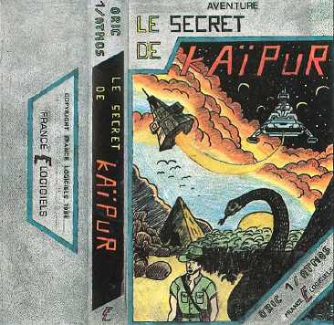
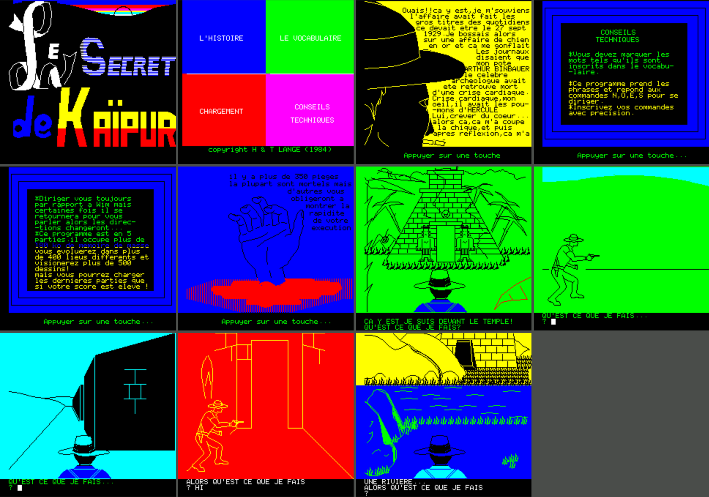
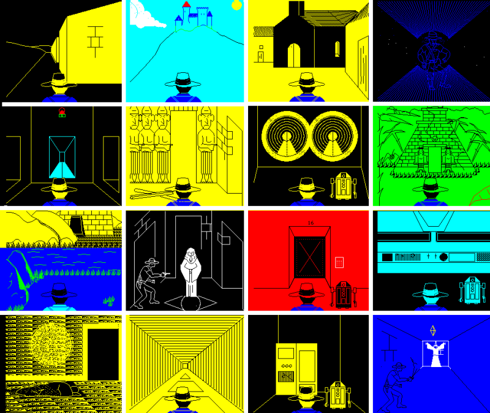

# Le-Secret-de-Kaipur
An Oric adventure game in Tangerine BASIC, I wrote in 1984
The only and solely purpose of this is documentation, retrogaming and archiving.

[French manual](kaipur_manuel.pdf "French manual PDF")

## Cover box (cassette)

## Solution
The game contains 6 parts:
[Solution Parts 3,4,5 and 6](kaipur_manuel.pdf "Solution 3456 PDF")
### Part 6 diagram

## Screenshots

