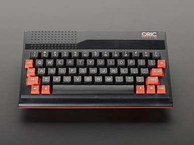
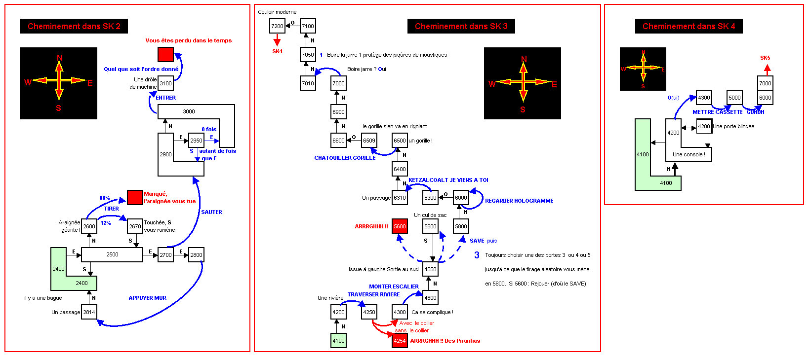
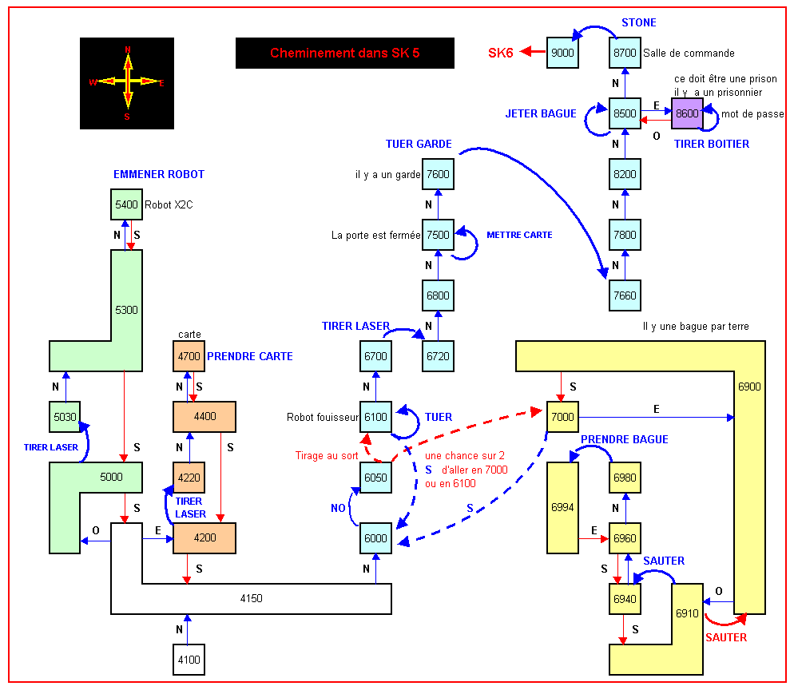

# Le-Secret-de-Kaipur
An Oric adventure game in Tangerine BASIC, I wrote in 1984. The only and solely purpose of this is documentation, retrogaming and archiving.




Oric Atmos


## [French manual](kaipur_manuel.pdf "French manual PDF")
## Cover box (cassette)

## Game screenshots

## More screenshots

## Solution
Text analyzer commands:
```
V$= "ENTRER","SAUTER","PRENDRE","TIRER","JURER","CONNECTER","APPUYER","RAMPER",
    "LIRE","POUSSER","CROISER","TROUVER","METTRE","TRAVERSER","MONTER","DESCENDRE",
    "SUICIDER","REGARDER","CHATOUILLER","BOIRE","ENDUIRE","ENCLENCHER","BAISSER",
    "ETALER","FRAPPER","TUER","JETTER","PRIER","CASSER","LAISSER"
N$= "TEMPLE","BAGUE","REVOLVER","MACHINE","BOUTON","PARCHEMIN","MUR","BARRE","CASSETTE",
    "CODE","COLLIER","ECRITURES","STATUETTE","RIVIERE","ESCALIER","VASE","MASQUE",
    "HOLOGRAMME","MOMMIE","ESPRIT","SCORPIONS","LAMES","CONDOR","GORILLE","BOL","EPEE",
    "MANETTE","CONVERTISSEUR","TEMPOREL","CASQUE"

```
The game contains 6 parts (numbers are BASIC line numbers in source code for screens):
- #### [Solution Parts 3,4,5 and 6](kaipur_manuel.pdf "Solution 3456 PDF")
- #### Parts 2,3,4 plans:

- #### Part 5 plan:

- #### Part 6 plan:


Thanks to Dom50, Symoon, laurentD75 from http://www.oric.org/
